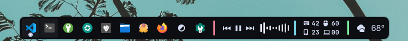

# Advanced separator

Customizable separator widget for the KDE Plasma Desktop

## Features

- Height
- Width
- Margin (left/right)
- Radius
- Color
  - Custom
  - Color list (applies to all separators)
  - System theme
  - Random
  - Alpha
- Automatic configuration synchronization of all separators (can be disabled per instance)

## Installation

Install from the [KDE Store](https://store.kde.org/p/2355537)

1. **Right click on the Panel** > **Add or manage widgets** > **Add new...** > **Download new...**
2. **Search** for "**Advanced separator**", install and add it to a Panel.
